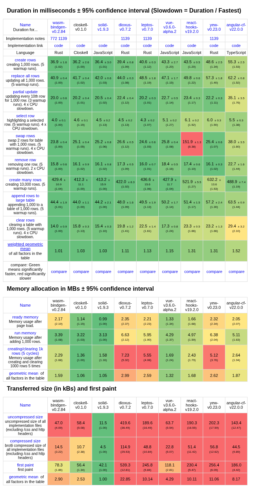

# Closkell

Closkell is a Clojure-inspired language that compiles to JavaScript, paired
with an Elm-inspired frontend framework.

The repository includes three example projects ported from Solid, one of them
around 50k lines, to show that the language and framework are usable for real
applications.

## Why

React's performance is not enough for some highly dynamic UIs, and its overhead
can be too much for small projects.

Solid is fast, but it can be hard for AI tools, and for people, because of its
Proxy-based reactivity model and its footguns.

Closkell explores a language and framework shaped for this niche: faster than
typical runtime-only UI frameworks, and simpler for AI-assisted development
than Proxy-heavy JavaScript patterns.

## Why not

Porting projects and benchmark work showed that building a language and
framework with AI is viable, but it does not make sense for a single
developer. There is too much to support and too little to gain.

## Benchmarks

Closkell is compiled, which gives it room to outperform runtime-only
frameworks. In `js-framework-benchmark`, Closkell ranks in the top two among
the selected keyed frameworks for weighted geometric mean, first paint, and
compressed bundle size.

## Design Docs

- [Design document overview](docs/language-framework-design.md)
- [Language core](docs/language-design.md)
- [Browser framework](docs/web-framework-design.md)
- [Server framework](docs/server-framework-design.md)

## Workspace

- `syntax`: source spans, diagnostics, Lisp parser, and the first `#html` reader
- `macro_expand`: deterministic expansion boundary with quasiquote, gensyms, and `compile-error`
- `hir`: typed compiler-facing module shape
- `typecheck`: initial local inference and shape checks
- `effects`: command-effect catalog and validation boundary
- `template_ir`: static DOM/update-slot lowering
- `js_emit`: JavaScript ESM emission
- `cli`: `closkell` developer commands
- `runtime-js`: runtime helpers consumed by generated JS
- `packages/vite-plugin-closkell`: Vite plugin that lets apps import `.clsk`
  modules directly
- `packages/vscode-closkell`: VS Code extension with syntax highlighting,
  formatter, and diagnostics support for `.clsk` files
